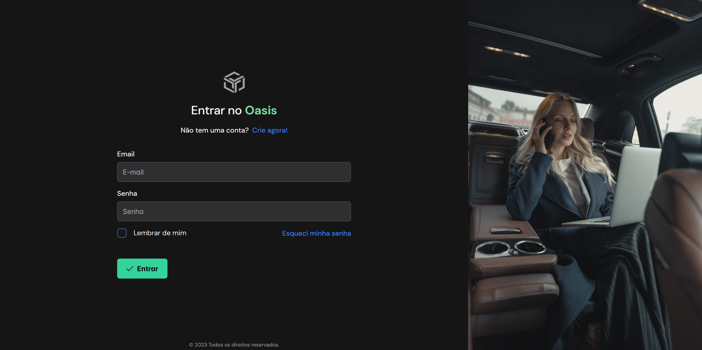

# Oasis Finance
### About the Project
This project is an open-source application developed in Angular, aimed at helping users efficiently and intuitively manage their personal finances. Our goal is to provide a tool that is both powerful and easy to use, allowing users to track their expenses, income, and invest in their financial education.

### Features
Expense and Income Tracking: Record and track your daily, monthly, and annual expenses and income.
Custom Budgeting: Create personalized budgets for different spending categories.
Financial Analysis: Gain insights into your spending habits with detailed charts and reports.
Financial Education: Access articles and tips to improve your financial health.
Technologies Used
* Angular: The main framework for the development of the application.
* PrimeNG: For the responsive and modern design of the interface.

### How to Contribute
Contributions are always welcome! If you are interested in contributing to the project, please read our CONTRIBUTING.md for more information on how to submit pull requests.

### License
This project is under the MIT license. See the LICENSE file for more details.
